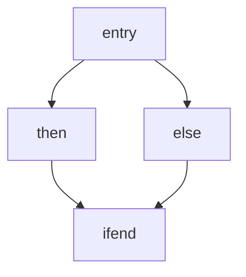

# Toy Compiler: LLVM IR Codegen, CFG, Dominators and SSA

A from-scratch toy compiler. It parses a small language into an AST, generates **LLVM IR**, and runs its own **control flow graph** and **dominator** analyses. It is being extended toward full **SSA construction** (dominator tree, dominance frontiers, phi nodes) and SSA-based optimizations.

> **Status: work in progress.** AST, LLVM IR codegen, CFG, DFS and dominator sets work today. Dominator tree, dominance frontiers, phi placement and SSA optimizations are on the roadmap below.

---

## Table of contents

- [Status](#status)
- [Demo 1: LLVM IR codegen](#demo-1-llvm-ir-codegen)
- [Demo 2: CFG, DFS and dominators](#demo-2-cfg-dfs-and-dominators)
- [How it works](#how-it-works)
- [Project structure](#project-structure)
- [Building and running](#building-and-running)
- [Roadmap](#roadmap)
- [References](#references)

---

## Status

| Component                          | Status        |
|------------------------------------|---------------|
| AST (assignment, if / else)        | Done          |
| LLVM IR codegen                    | Done          |
| Basic blocks                       | Done          |
| CFG (successors / predecessors)    | Done          |
| DFS traversal                      | Done          |
| Dominator sets                     | Done          |
| Immediate dominators / dom tree    | In progress   |
| Dominance frontiers                | Planned       |
| Phi node placement                 | Planned       |
| Variable renaming (SSA)            | Planned       |
| SSA optimizations                  | Planned       |

---

## Demo 1: LLVM IR codegen

Each AST node has a `codegen()` method that emits LLVM IR. Variables are lowered to `alloca` / `store` / `load`, and `if` statements become `then` / `else` / `ifend` basic blocks joined by conditional and unconditional branches.

### `if` with `else`


- `x` is allocated and stored (`x = 3`), then loaded and compared with `5` using `icmp slt`.
- `br i1 %cmptmp, label %then, label %else` splits control flow.
- Both branches end with `br label %ifend`, so `ifend` has two predecessors (`%then` and `%else`). This is the join point where phi nodes will be needed once SSA is in place.

### `if` without `else`

https://github.com/payal101/compiler-/blob/main/llvm_ir_if_then.png

- With no `else`, the false edge goes straight to the join block: `br i1 %cmptmp, label %then, label %ifend`.
- The `then` block reads `x`, computes `x + 1`, and stores the result into `y`.

The CFG for the if/else case is the diamond below:



---

## Demo 2: CFG, DFS and dominators

The analysis passes print the CFG, a DFS traversal and the dominator sets for the same diamond:
https://github.com/payal101/compiler-/blob/main/cfg_dfs_dominators_output.png

1. **CFG**: every `BasicBlock` is printed with its successors and predecessors. `entry` has no predecessors, and `ifend` has two (`then`, `else`).
2. **DFS**: blocks are visited in depth-first order from `entry`.
3. **Dominators**: `Dom(B)` lists every block that lies on all paths from `entry` to `B`. For example, `Dom(then) = {then, entry}`.

---

## How it works

### Pipeline

```
source  ->  AST  ->  LLVM IR (alloca/load/store)  ->  CFG  ->  dominators
                                                                  |
                                                                  v
                          dominance frontiers  ->  phi placement  ->  renaming  ->  SSA opts
```

### Codegen

Every AST node (`AssignmentExpr`, `IfStmt`, ...) implements `codegen()`. Variables live in stack slots (`alloca`), reads are `load`, writes are `store`. This keeps codegen simple and defers SSA construction to a dedicated pass.

### Basic blocks and CFG

Each `BasicBlock` stores a name, a list of **successors** and a list of **predecessors**. The CFG can be printed for inspection.

### Dominators

Block `A` **dominates** block `B` if every path from `entry` to `B` passes through `A`. Every block dominates itself, so `B` is always in `Dom(B)`.

### SSA (in progress)

- **Dominator tree**: connect each block to its immediate dominator.
- **Dominance frontier**: for a block `A`, the blocks where `A`'s dominance stops. These are the join points that may need a phi node.
- **Phi nodes**: for each variable, insert a phi at the iterated dominance frontier of the blocks that define it.
- **Renaming**: walk the dominator tree and give each definition a unique version.

---

## Project structure

```
.
├── include/        # Headers: AST, basic block, CFG, dominators
├── src/            # Implementations and driver
├── docs/           # Screenshots used in this README
└── README.md
```

Adjust the tree above to match your actual files.

---

## Building and running

```bash
# Replace with your actual commands, for example:
clang++ -std=c++17 -Iinclude src/*.cpp $(llvm-config --cxxflags --ldflags --libs core) -o toy
./toy
```

---

## Roadmap

- [x] AST and LLVM IR codegen for assignments and if / else
- [x] Basic blocks and CFG
- [x] DFS traversal
- [x] Dominator sets
- [x] Immediate dominators and dominator tree
- [x] Dominance frontiers and iterated dominance frontier
- [x] Phi node placement
- [x] Variable renaming (full SSA construction)
- [ ] SSA verification pass
- [ ] SSA-based optimizations: constant propagation, copy propagation, dead code elimination
- [ ] Out-of-SSA translation

---

## References

- K. Cooper, T. Harvey, K. Kennedy. *A Simple, Fast Dominance Algorithm*.
- R. Cytron et al. *Efficiently Computing Static Single Assignment Form and the Control Dependence Graph*, 1991.
- A. Appel. *Modern Compiler Implementation*, SSA chapters.
- LLVM Language Reference Manual and the Kaleidoscope tutorial.
